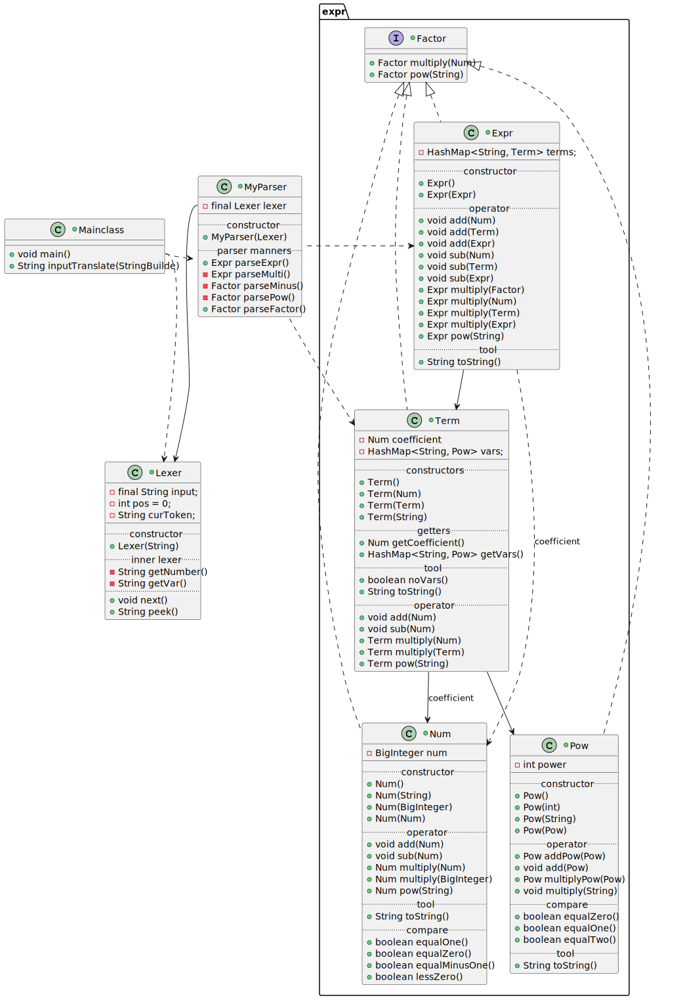
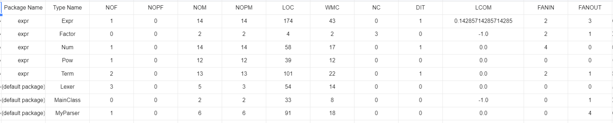
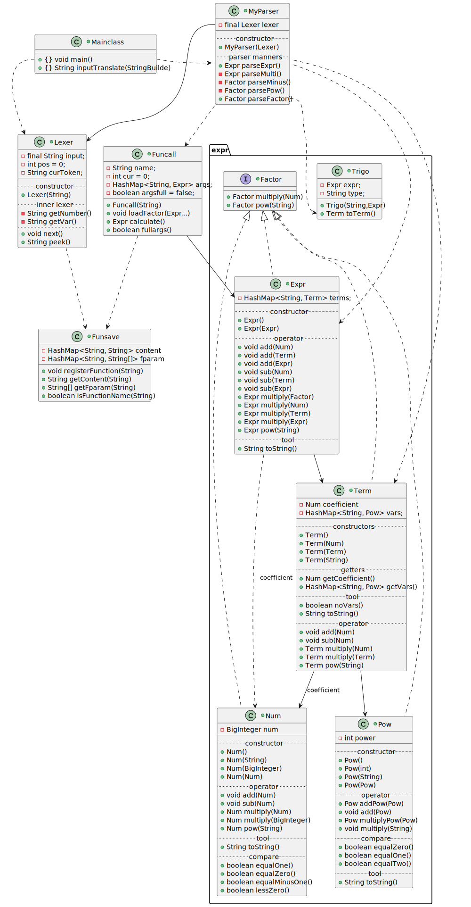
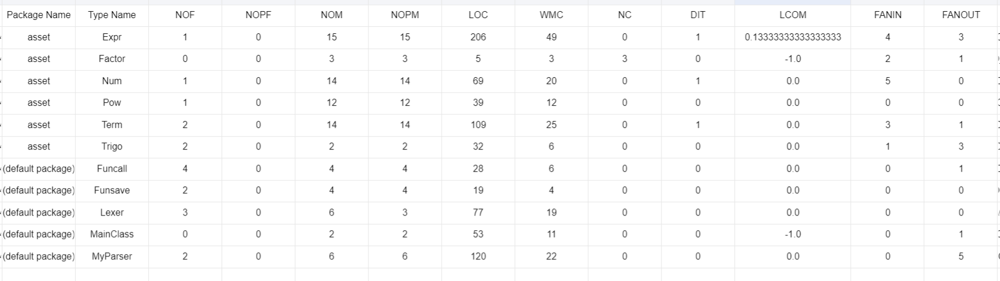
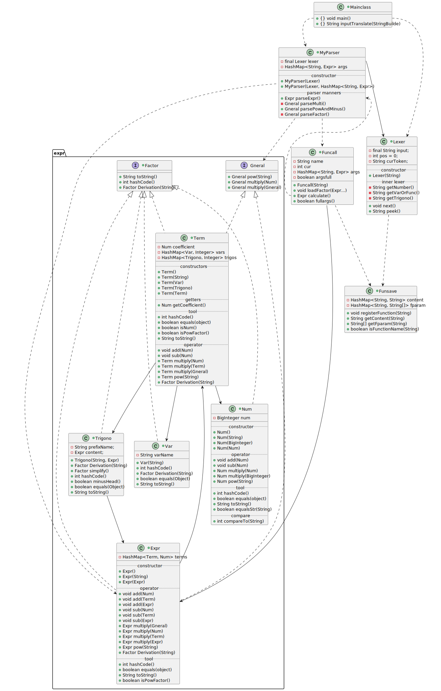
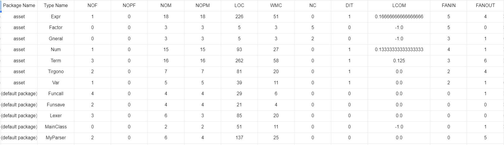

# buaa OO unit1

## 题目在哪里

仓库顶层目录 `面向对象设计与构造第三次作业.md`

## hw1总结

### uml图&架构



hw1是最惨痛的一次(~~因为没交上~~)，主要是对递归下降不熟悉，但是hw1也奠定了我整个三次作业的基础，虽说hw3重构了，但是基本框架没变，只是细化了数据存储部分

宏观上来说架构是：解析部分 + 数据存储操作部分(expr包中)

解析部分：按我的思路，递归下降是通过运算优先级分层的。
如上图，MyParser::Expr是最顶层，解析加法；MyParser::ParseMulti是优先于它的解析乘法。MyParser::ParseMinus最顶层的解析factor前缀符号；MyParser::ParsePow是次之的解析factor幂次；parseFactor是最底层的解析变量(强行提升为Term)或者表达式
而这几个解析之间的数据交流是Term和Expr实现的

数据存储操作部分：核心是 Term的运算
Term存储单项式(系数,变量名及各自的幂次)
Expr存储多项式(Term串)
流通于包外的数据只有Term和Expr，而Expr的运算是通过foreach,lambda表达式或者迭代器循环调用Term实现的运算，Term具体的计算和合并通过hashmap查变量名后改变内容幂次，但是系数的操作是通过Expr调配的，Term的系数只起到初始化Expr中系数的作用

#### 优点

1. 结构简单清晰，不容易出现结构上的大错误
2. 拷贝了一些不变的量，导致时空间亏损

#### 缺点

1. 考验封装技巧，极其容易出现深浅拷贝错误
2. 由于封装，码量偏大

### metrics表&评价



没有公有字段(因为被OO_style强烈推荐了)
NOM数目偏大：说明方法数目偏多，主要是涉及多态的问题，需要大量方法重载，这也导致LOC偏大
LCOM值都比较小,Term和Expr的扇入较大：说明高内聚低耦合要求基本达到了
Expr的扇出较高，稳定性不大好(因为依赖了Term)

按数据来看Expr最容易受到影响

### bug分析

没进入互测，但是发现了自己深浅拷贝和笔误的bug
前者在同一个变量不同行为时候容易出错，比如乘方

## hw2总结

### uml图&架构分析



在前者的基础上迭代增加了自定义函数因子和三角函数因子

对于三角函数只需要在解析因子(MyParser::parseFactor中)调用MyParser::parseExpr然后将其转为输出字符串，并当作普通变量处理 (这里埋下了hw3重构的祸根)
对于自定义函数，由于字符串替换带来的诸多限制和可能的bug(重复替换)，这里我选择传参计算，实现步骤：

1. 设计注册函数(静态)类，支持函数名，实参名，函数内容的存储与判定
2. 升级Lexer，使其支持函数头识别
3. 升级MyParser，使其支持识别形参并带参运算
4. 构造函数调用类，便于MyParser::parseFactor时调用其判定满参，以及返回计算结果表达式

计算时，我们只需要在MyParser识别到函数头时调用parseExpr得到足够多的参数传入Funcall再返回结果即可，这样无论什么做实参先展开再传入能保证传入参数正确性

#### 优点

1. 函数运算不容易出错
2. 还是设计简单
3. 深拷贝问题没能解决

#### 缺点

1. 字符串化三角函数直接导致hw3无法求导

### metrics表&评价



和上次如出一辙

### bug分析

自己的

1. 在解决了hw1的深浅拷贝后，hw2函数传参计算时，又出现了没先拷贝实参再传入
2. 没仔细看题忘了处理尾空格导致RE

互测的

1. 效率堪忧，平方函数传参表达式的平方导致RE (难以补救
2. sin(x)**0==sin(x)的问题，应该是没升级预处理正则替换导致幂次直接被忽略
3. 实参(sin(x))**n被当作sin(x)的问题，应该是传参三角函数的时候没使用表达式传参

## hw3总结

### uml图&框架分析



~~狠狠重构了~~
原因前面已经说了
实参函数前面已经支持了就不说了
这次的部分重构，主要是细化了数据存储结构，便于求导查探其内部结构，同时采用了类做key的hashmap，减少不必要的拷贝，但是hashcode的计算和equals的判定开销依然很大

#### 优点

结构更加清晰，扩展性良好(零参数，自定义变量名......)

#### 缺点

架构的计算准确性和数度都很依赖hashcode的设计技术

#### 输出优化

优化的架构已经有了，指将Term中的Var和Trigono特意分开，但是时间不允许
所以只写了三角函数的同类项合并，由于**HashMap是有序的(只要写好了HashCode)** 所以可以在生成Trigono实例的时候判定它内容表达式首项的正负号，统一为正即可
听一部分同学说可以判定相等和相加为0，我觉得效率上可能比较难受

### metrics表&评价



比起前两次扇入度稍有提升，整体上更加靠近高内聚低耦合

### bug分析

拷贝少了就一遍过了，觉得很好

互测的：
同学们代码质量明显提升，bug只找到一个（排除自定义函数无限代价
参数带入时认名不认位

```cmd
2
f(x) = x
g(x,y) = f(y)
g(3,x)
```

会被错算为3
应该是函数嵌套逻辑的漏洞，修改较为简单

## 互测策略

较为原始

1. 有的放矢尝试数据
2. 投喂自己公测debug时产生的数据
